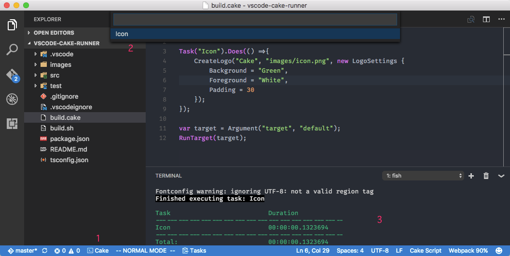

## Cake Runner

Execute Cake task in Visual Studio Code.

Under development ...

## Support

- [x] macOS
- [ ] Windows

## Requirement

- `build.cake`
- Cake bootstrap 
  - `build.sh` for macOS
  - `build.ps1` for Windows

## Install

- <kbd>Command</kbd> + <kbd>P</kbd>
- ext install cake-runner

## Usage

- Open any file in Visual Studio Code (enable "workbench.action.terminal.runSelectedText").
- Click `Cake` icon in Task bar.
- Select task name in Quick Pick dialog.
- See output in Termimal.

## Note

- You can install Cake bootstrap with [official extension](https://marketplace.visualstudio.com/items?itemName=cake-build.cake-vscode).